# Ansible Role: Fail2Ban

Install and configure Fail2Ban on supported Linux systems.

This role installs the operating-system `fail2ban` package, keeps the
historical `fail2ban_pkg_install_latest` switch for compatibility, writes a
managed `jail.local`, optionally renders custom filter and action templates,
and validates that `fail2ban-client` is available after installation.

## Table of Contents

- [Overview](#overview)
- [Role Flow](#role-flow)
- [Requirements](#requirements)
- [Installation](#installation)
- [Variables](#variables)
- [Supported Linux Matrix](#supported-linux-matrix)
- [Examples](#examples)
- [Testing](#testing)
- [Jenkins CI](#jenkins-ci)
- [Publishing](#publishing)
- [Development Notes](#development-notes)
- [Changelog](#changelog)
- [Maintainer](#maintainer)
- [Inspiration](#inspiration)
- [Support](#support)
- [Repository](#repository)
- [License](#license)

## Overview

The role is focused on the default Linux Fail2Ban installation path:

- install the Fail2Ban package from the target distribution repositories
- enable EPEL automatically on Enterprise Linux targets where needed
- manage `/etc/fail2ban/jail.local` from namespaced role variables
- optionally render additional filter and action templates
- optionally enable and start the Fail2Ban service
- verify `fail2ban-client` after installation
- exercise the role through a Workspace-managed Docker test matrix

The role does not provision cloud resources. Local Docker validation is enough
because the role manages operating-system packages, local configuration files,
and a local service.

## Role Flow

This role flow is defined by `tasks/main.yml`, `tasks/install.yml`,
`tasks/configure.yml`, `tasks/service.yml`, and `tasks/verify.yml`.

```mermaid
flowchart LR
  accTitle: Role execution flow
  accDescr: Shows validation, package installation, configuration, service management, and command verification.
  start["Run role"] --> validate["Validate settings"]
  validate --> apt{"Apt target?"}
  apt -->|Yes| cache["Refresh cache"]
  apt -->|No| epel{"Enterprise Linux?"}
  cache --> epel
  epel -->|Yes| repo["Install EPEL"]
  epel -->|No| install["Install package"]
  repo --> install
  install --> configure["Render configuration"]
  configure --> service{"Manage service?"}
  service -->|Yes| manage["Enable and start"]
  service -->|No| verify{"Verify enabled?"}
  manage --> verify
  verify -->|Yes| client["Check fail2ban-client"]
  verify -->|No| complete["Complete"]
  client --> complete
```



## Requirements

- Ansible Core 2.16 or newer
- a supported Linux target with administrator or sudo access
- an operating-system package repository that exposes `fail2ban`, or EPEL for
  Enterprise Linux targets
- the `community.docker` collection and local Docker service for the default
  container-backed test harness

## Installation

Current local development role name:

```text
ansible-fail2ban
```

Intended Ansible Galaxy role name:

```text
inviqa.fail2ban
```

After the first Inviqa Galaxy import is complete, install a pinned release with:

```bash
ansible-galaxy role install inviqa.fail2ban,<version>
```

Until that import exists, consume the role from a local checkout or a pinned Git
reference.

## Variables

| Variable | Default | Notes |
| --- | --- | --- |
| `fail2ban_package_name` | `fail2ban` | Operating-system package to install. |
| `fail2ban_pkg_install_latest` | `false` | Compatibility switch for consumers familiar with the role this work was inspired by. When true, `fail2ban_package_state` resolves to `latest`. |
| `fail2ban_package_state` | `{{ 'latest' if fail2ban_pkg_install_latest \| bool else 'present' }}` | Package state passed to `ansible.builtin.package`. Supported values are `present` and `latest`. |
| `fail2ban_epel_enabled` | Enterprise Linux only | Install `fail2ban_epel_package_name` before Fail2Ban on AlmaLinux, CentOS, Red Hat, and Rocky Linux targets. |
| `fail2ban_epel_package_name` | `epel-release` | Repository package used to expose Fail2Ban on Enterprise Linux targets. |
| `fail2ban_apt_update_cache` | `true` | Update the apt cache before installing the package on apt-based targets. |
| `fail2ban_apt_cache_valid_time` | `3600` | Cache validity window, in seconds, passed to `ansible.builtin.apt`. |
| `fail2ban_config_dir` | `/etc/fail2ban` | Base configuration directory. |
| `fail2ban_filter_dir` | `{{ fail2ban_config_dir }}/filter.d` | Directory for managed custom filter files. |
| `fail2ban_action_dir` | `{{ fail2ban_config_dir }}/action.d` | Directory for managed custom action files. |
| `fail2ban_jail_local_path` | `{{ fail2ban_config_dir }}/jail.local` | Managed Fail2Ban local jail configuration. |
| `fail2ban_ignoreip` | `{{ fail2ban_default_ignoreip }}` | Default ignore IP list written to `[DEFAULT]`. |
| `fail2ban_bantime` | `600` | Default ban time in seconds. |
| `fail2ban_findtime` | `600` | Default find time in seconds. |
| `fail2ban_maxretry` | `5` | Default retry count. |
| `fail2ban_backend` | `auto` | Fail2Ban log backend. |
| `fail2ban_usedns` | `warn` | Fail2Ban DNS handling mode. |
| `fail2ban_banaction` | `iptables-multiport` | Default banning action. |
| `fail2ban_default_action` | `%(action_)s` | Default Fail2Ban action interpolation. |
| `fail2ban_jails` | `{}` | Mapping of jail names to option mappings, or a list of jail objects with non-empty `name` and mapping `config` values, rendered into `jail.local`. |
| `fail2ban_custom_filters` | `[]` | Optional custom filter templates to render into `filter.d`. |
| `fail2ban_custom_actions` | `[]` | Optional custom action templates to render into `action.d`. |
| `fail2ban_manage_service` | `true` | Manage the Fail2Ban service after configuration. |
| `fail2ban_service_enabled` | `true` | Enable the service at boot when service management is enabled. |
| `fail2ban_service_state` | `started` | Service state passed to `ansible.builtin.service`. |
| `fail2ban_verify_install` | `true` | Verify `fail2ban-client` after package installation. |
| `fail2ban_client_command` | `fail2ban-client` | Command used for verification and tests. |

## Supported Linux Matrix

The practical validation matrix is intentionally aligned with the local Docker
test harness. It covers the latest stable release and one still-relevant
previous stable or LTS release for each primary family:

| Family | Latest stable test image | Previous stable or LTS test image |
| --- | --- | --- |
| Debian | `geerlingguy/docker-debian13-ansible:latest` | `geerlingguy/docker-debian12-ansible:latest` |
| Enterprise Linux | `geerlingguy/docker-rockylinux10-ansible:latest` | `geerlingguy/docker-rockylinux9-ansible:latest` |
| Ubuntu | `geerlingguy/docker-ubuntu2604-ansible:latest` | `geerlingguy/docker-ubuntu2404-ansible:latest` |

Galaxy metadata also advertises current Debian, Ubuntu, Fedora, and Enterprise
Linux releases where Fail2Ban is expected to be available through the standard
package manager or EPEL.

Run this role as a privileged user or set `become: true` in the calling
playbook when the target user cannot install packages or manage services
directly.

## Examples

```yaml
---
- name: Install Fail2Ban
  hosts: linux_devices
  become: true
  roles:
    - role: inviqa.fail2ban
      vars:
        fail2ban_pkg_install_latest: false
```

Use the newer package-state variable when writing fresh playbooks:

```yaml
---
- name: Install latest Fail2Ban
  hosts: linux_devices
  become: true
  roles:
    - role: inviqa.fail2ban
      vars:
        fail2ban_package_state: latest
```

Configure a disabled SSH jail so the file is ready but the service behavior
stays operator-controlled:

```yaml
---
- name: Install Fail2Ban with an SSH jail definition
  hosts: linux_devices
  become: true
  roles:
    - role: inviqa.fail2ban
      vars:
        fail2ban_jails:
          sshd:
            enabled: false
            filter: sshd
            logpath: /var/log/auth.log
            maxretry: 6
            port: ssh
```

Use list-style jail definitions when a jail needs nested filter or action
objects. Each list entry must define a non-empty `name` and a `config` mapping:

```yaml
---
- name: Install Fail2Ban with a rich SSH jail definition
  hosts: linux_devices
  become: true
  roles:
    - role: inviqa.fail2ban
      vars:
        fail2ban_jails:
          - name: ssh-rich
            config:
              enabled: true
              filter:
                name: sshd
              actions:
                - action:
                    name: iptables-multiport
                  args:
                    name: ssh-rich
                    port: ssh
                    protocol: tcp
              logpath: /var/log/auth.log
              maxretry: 3
              port: ssh
```

For local checkout testing before Galaxy publication, use the local role name
`ansible-fail2ban`.

## Testing

The current test workflow is documented in [docs/testing.md](docs/testing.md).
It covers Workspace commands, container tests, syntax checks, Jenkinsfile lint,
cleanup, and the Workspace CLI install command.

## Jenkins CI

[docs/jenkins-ci.md](docs/jenkins-ci.md) documents the private Jenkins
pipeline, required credential IDs and bindings, Jenkinsfile lint helper, and
container-backed validation sequence.

## Publishing

[docs/ansible-galaxy-release.md](docs/ansible-galaxy-release.md) documents the
GitHub release and Ansible Galaxy import runbook.

After the GitHub release and tag exist on `main`, import the role into Galaxy
with:

```bash
ws github release check
ws ansible galaxy publish
```

The commands use `github.api_token` and `ansible.galaxy.token` from
`workspace.override.yml`, or `GITHUB_TOKEN` and `ANSIBLE_GALAXY_TOKEN` from the
shell environment.

Jenkins can also create the GitHub release and import the role into Galaxy from
the `main` branch with separate publication build parameters. See
[docs/jenkins-ci.md](docs/jenkins-ci.md) for the required Jenkins credentials
and publication controls.

## Development Notes

- `AGENTS.md` defines strict repository linting and documentation rules for AI
  coding agents.
- `.ansible/` is generated dependency/cache output and should not be committed.
- `workspace.override.yml` is gitignored and may hold local release tokens.
- The Workspace console mounts only the repository and Docker socket; this role
  has no SSH-agent or SSH config dependency.
- Keep the role support matrix aligned with the tested Linux matrix before
  publishing a new Galaxy release.

## Changelog

See [CHANGELOG.md](CHANGELOG.md) for release history.

## Maintainer

- Author: Marco Massari Calderone `<marco.massari-calder@inviqa.com>`
- Copyright holder for Inviqa-maintained changes: Inviqa UK Ltd

## Inspiration

This role is inspired by Barney Hanlon's earlier MIT-licensed Fail2Ban role
from the `shrikeh-ansible-roles/ansible-fail2ban` GitHub organization. The
current role has been substantially rebuilt for the Inviqa Ansible role
toolchain, documentation model, and test harness.

## Support

For current maintenance and publication work, contact the maintainer above. If
the role is published publicly, issue-tracking and support paths should be
documented alongside the published source.

## Repository

- Public repository URL: <https://github.com/inviqa/ansible-fail2ban>
- Inspiration: <https://github.com/shrikeh-ansible-roles/ansible-fail2ban>
- Ansible Galaxy role: <https://galaxy.ansible.com/ui/standalone/roles/inviqa/fail2ban/>
- Publication status: pending first Inviqa Ansible Galaxy import

## License

MIT
