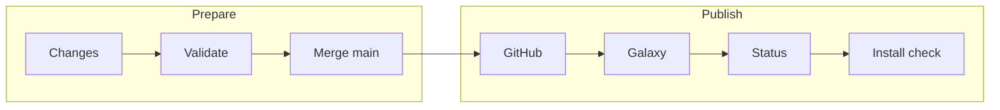
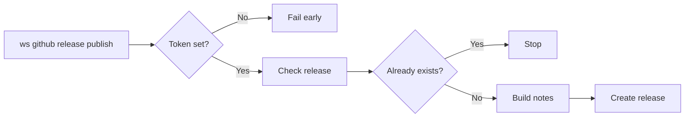
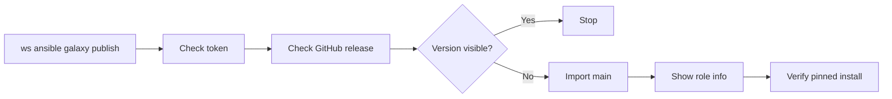

# Ansible Galaxy Release Runbook

This runbook describes how to publish the standalone `inviqa.fail2ban` Ansible
role to Ansible Galaxy after a GitHub release is ready.

Use the current release version wherever the examples show `0.1.0`.

## Table of Contents

- [Release Flow](#release-flow)
- [Release Order](#release-order)
- [Local Preflight](#local-preflight)
- [GitHub Release](#github-release)
- [Ansible Galaxy Token](#ansible-galaxy-token)
- [Publish to Galaxy](#publish-to-galaxy)
- [Jenkins Publication](#jenkins-publication)
- [Inspect Galaxy State](#inspect-galaxy-state)
- [Verify Installation](#verify-installation)
- [Troubleshooting](#troubleshooting)

## Release Flow

The release flow groups local preparation and external publication while
keeping the `main` branch handoff explicit.



## Release Order

1. Finish and validate the repository changes locally.
2. Finalize `CHANGELOG.md` by moving release-ready notes from `Unreleased` into
   a concrete SemVer heading with a plain `YYYY-MM-DD` date.
3. Merge the release branch to `main`.
4. Create the GitHub release and SemVer tag.
5. Import `main` into Ansible Galaxy.
6. Verify the Galaxy role metadata and pinned install path.

Ansible Galaxy imports standalone role releases from GitHub. The role version
is discovered from Git tags that match Semantic Versioning.

## Local Preflight

Run the repository checks that apply to the release changes. At minimum, use
the targeted linters for changed files and run the role lint before publishing:

```bash
ws ansible lint
ws ansible syntax
ws test-docker
markdownlint -c ~/.markdownlint.json README.md CHANGELOG.md docs/ansible-galaxy-release.md
```

Also run the Jenkinsfile linter when `Jenkinsfile` changes:

```bash
ws lint-jenkinsfile
```

## GitHub Release

Before importing into Galaxy:

1. Ensure `CHANGELOG.md` has a release-ready concrete version entry.
2. Ensure major releases link to an upgrade guide when they contain breaking
   changes.
3. Merge the release branch to `main`.
4. Tag the release with the same SemVer version that Galaxy should expose.
5. Push `main` and the tag to GitHub.
6. Create the GitHub release from the tag.

For example, a `0.1.0` release should include the feature summary from
`CHANGELOG.md` in the GitHub release body.

Check whether the latest concrete changelog release already exists on GitHub:

```bash
ws github release check
```

If the release exists, the command exits successfully. If the changelog release
exists locally but is not published on GitHub yet, the command exits with code
`2`. If only `Unreleased` notes exist, finalize a concrete changelog release
section before publishing.

Publish the latest concrete changelog release to GitHub:

```bash
ws github release publish
```

The GitHub release command path is defined by `ws github release publish` in
`workspace.yml`.



Set `RELEASE_VERSION` to target a specific changelog section:

```bash
RELEASE_VERSION=0.1.0 ws github release check
RELEASE_VERSION=0.1.0 ws github release publish
```

Use these Workspace release actions:

| Command | Purpose |
| --- | --- |
| `ws github release check` | Verify that the changelog release is already published on GitHub. |
| `ws github release publish` | Create the GitHub release from the latest concrete changelog entry. |
| `ws ansible galaxy check-token` | Verify that the Galaxy token is available before token-required actions. |
| `ws ansible galaxy check-release` | Verify that the GitHub release exists and the pinned Galaxy install succeeds. |
| `ws ansible galaxy info` | Show the currently indexed Galaxy role metadata. |
| `ws ansible galaxy status` | Show the latest Galaxy import status. |
| `ws ansible galaxy publish` | Import `main` into Galaxy and verify the pinned Galaxy install. |

## Ansible Galaxy Token

Use the current Galaxy token page:

```text
https://galaxy.ansible.com/ui/token/
```

The Workspace publication commands read release credentials from
`workspace.override.yml`:

```ruby
attribute('ansible.galaxy.token'): 'your-token'
attribute('github.api_token'): 'your-token'
```

The same commands also accept `ANSIBLE_GALAXY_TOKEN` from the shell
environment for Galaxy and `GITHUB_TOKEN` for GitHub.

Official Galaxy documentation describes tokens as user-account tokens. It does
not document a separate public Galaxy machine-user or service-account token
type. For a Jenkins token that should not belong to a person, use a dedicated
operational GitHub account when company policy allows it:

1. Create or use a GitHub account reserved for Ansible role publishing.
2. Grant that account the GitHub repository access required by the release
   workflow.
3. Log in to Galaxy with that GitHub account.
4. Ensure the Galaxy account can import into the required namespace or role.
5. Open `https://galaxy.ansible.com/ui/token/` while logged in as that account.
6. Select `Load Token`, copy the token once, and store it in Jenkins as the
   `ansible-roles-galaxy-token` Secret text credential.

If a dedicated GitHub publishing account is not allowed, use a maintainer-owned
Galaxy token as an explicit operational exception and rotate it when the
maintainer changes role. Do not use a personal token silently for Jenkins.

For local release testing without `workspace.override.yml`, export a personal
GitHub token before running the Workspace command:

```bash
export GITHUB_TOKEN="your-token"
ws github release check
```

## Publish to Galaxy

After the GitHub release and tag exist on `main`, run:

```bash
ws ansible galaxy publish
```

The Galaxy publication command path is defined by `ws ansible galaxy publish`
in `workspace.yml`.



This imports the role with the repository's fixed Galaxy publication settings:

- namespace: `inviqa`
- GitHub repository: `inviqa/ansible-fail2ban`
- branch: `main`
- Galaxy role name: `fail2ban`

The command also prints `ansible-galaxy role info inviqa.fail2ban` after a
successful import.

## Jenkins Publication

Jenkins can publish the GitHub release and import the role into Galaxy after a
successful `main` build. The two publication steps are separate stages
controlled by Jenkins build parameters.

Jenkins needs these credentials:

| Credential ID | Jenkins type | Purpose |
| --- | --- | --- |
| `inviqa-ansible-roles-releases` | Secret text | Creates the GitHub release in `inviqa/ansible-fail2ban`. |
| `ansible-roles-galaxy-token` | Secret text | Imports the role into Ansible Galaxy. Prefer a token loaded by a dedicated Galaxy publishing account rather than a personal maintainer account. |

Both Jenkins publication stages call Workspace commands directly:

```bash
ws github release publish
ws ansible galaxy publish
```

This keeps Jenkins as an orchestrator only. The release checks and publication
behavior remain reusable from a local checkout.

## Inspect Galaxy State

Check the currently indexed role metadata without a token:

```bash
ws ansible galaxy info
```

Check the latest import status with a token:

```bash
ws ansible galaxy status
```

After import, confirm that Galaxy reports:

- `github_branch: main`
- the latest release commit or tag commit
- the updated role description from `meta/main.yml`
- the expected version in the Galaxy UI
- a successful pinned install for the release version

## Verify Installation

After Galaxy finishes importing the release, verify a pinned install in a clean
temporary directory:

```bash
version="0.1.0"
tmp_dir="$(mktemp -d)"
ansible-galaxy role install --roles-path "${tmp_dir}" "inviqa.fail2ban,${version}"
find "${tmp_dir}" -maxdepth 2 -type f -name main.yml
rm -rf "${tmp_dir}"
```

For future releases, replace `0.1.0` with the release tag.

## Troubleshooting

- If Galaxy still reports `github_branch: master`, rerun
  `ws ansible galaxy publish` after confirming the GitHub default branch is
  `main`.
- If Galaxy does not show the new version, confirm the tag was pushed to GitHub
  and matches SemVer.
- If Jenkins fails before importing Galaxy, confirm `RELEASE_VERSION` matches a
  concrete `CHANGELOG.md` section and a pushed Git tag.
- If the role is not available on Galaxy yet, `ws ansible galaxy info` can fail
  until the first import succeeds.
