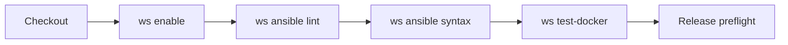
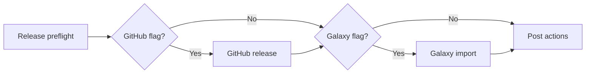
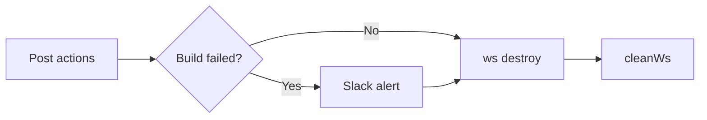

# Jenkins CI Integration

This repository includes a `Jenkinsfile` for running the same Ansible syntax
checks and Docker-backed Fail2Ban validation used during local maintenance.

## Table of Contents

- [Pipeline Coverage](#pipeline-coverage)
- [Jenkins Workspace Agent](#jenkins-workspace-agent)
- [Jenkins Setup](#jenkins-setup)
- [Jenkins Parameters](#jenkins-parameters)
- [Release Preflight](#release-preflight)
- [Release Publication](#release-publication)
- [Failure Handling](#failure-handling)

## Pipeline Coverage

The pipeline runs on a Jenkins node with Workspace installed and executes:

- Workspace environment startup with `ws enable`
- role linting through `ws ansible lint`
- the tracked `tests/roles/ansible-fail2ban` symlink so Ansible can resolve
  the checked-out role by name in Jenkins job workspaces
- syntax checks through `ws ansible syntax`
- container-backed role validation through `ws test-docker`
- non-mutating release preflight checks for GitHub release readiness and
  Ansible Galaxy token configuration
- optional GitHub release creation from `main`
- optional Ansible Galaxy import from `main`
- failure notification to the `ops-integrations` Slack channel

The pipeline does not provision live cloud resources. The Fail2Ban role
installs a local package, renders local configuration, and manages a local
service, so the Docker matrix is the current end-to-end test boundary.

The validation phase starts Workspace and runs the non-mutating checks before
any publication gate.



The publication phase keeps GitHub release creation and Galaxy import behind
their separate `main`-branch flags.



The post-build phase sends failure notifications, destroys the Workspace
environment, and cleans the Jenkins workspace.



Markdown and YAML checks are intentionally kept as pre-handoff checks rather
than Jenkins pipeline stages.

## Jenkins Workspace Agent

The Jenkinsfile follows this repository's Workspace-first maintenance pattern.
Jenkins runs on a `linux-amd64` node where the Workspace CLI is already
available. The pipeline calls `ws enable`, and Workspace starts the Docker
Compose services that provide the Ansible execution environment.

The Workspace `console` image installs the Python dependencies from
`tests/requirements.txt` and Ansible collections from `tests/requirements.yml`.
Jenkins does not run Ansible directly on the host.

## Jenkins Setup

Create a pipeline job that uses the repository `Jenkinsfile`.

Recommended Jenkins configuration:

- Agent label: `linux-amd64`
- Required tools on the agent:
  - Docker
  - Workspace CLI `ws`
- Required Jenkins credentials:
  - GitHub API token with write access to `inviqa/ansible-fail2ban`
  - Ansible Galaxy API token for the `inviqa` namespace, preferably loaded by a
    dedicated publishing account rather than a personal maintainer account
  - Slack token credential used for failure notifications

The credential bindings and fixed Workspace-facing environment variables are
defined at the top of `Jenkinsfile`:

| Placeholder | Jenkins credential type | Purpose |
| --- | --- | --- |
| `inviqa-ansible-roles-releases` | Secret text | GitHub API token used to create the release in `inviqa/ansible-fail2ban`. |
| `ansible-roles-galaxy-token` | Secret text | Ansible Galaxy API token used to import the role after the GitHub release exists. |
| `inviqa-slack-integration-token` | Secret text | Slack token used for Jenkins failure notifications. |

All credential IDs above must exist before the pipeline starts. Jenkins binds
them once in the top-level environment. `ws console` is the single Workspace
entrypoint that forwards matching environment variables into commands executed
inside the `console` container.

## Jenkins Parameters

Release publication is controlled by Jenkins build parameters:

| Parameter | Default | Purpose |
| --- | --- | --- |
| `RELEASE_VERSION` | empty | Optional release version to publish. When empty, Jenkins uses the latest concrete release section in `CHANGELOG.md`. |
| `PUBLISH_GITHUB_RELEASE` | `true` | Enables GitHub release publication on `main` after validation succeeds. |
| `PUBLISH_ANSIBLE_GALAXY_RELEASE` | `true` | Enables Ansible Galaxy import on `main` after validation succeeds. |

Jenkins shows these values on the job page through **Build with Parameters**.
Maintainers can change them for one build without editing `Jenkinsfile`.

Publication stages only run for the `main` branch. Pull request and
feature-branch builds cannot publish a release through this Jenkinsfile, even
when the publication parameters are enabled.

## Release Preflight

Every Jenkins build runs a non-mutating release preflight before publication
gates:

```text
ws github release check
ws ansible galaxy check-token
```

The GitHub check accepts exit code `0` when the release already exists and exit
code `2` when a release still needs publication or when only `Unreleased`
changelog notes exist. The latter is expected for a pull request that prepares
a release.

The Galaxy token check validates credential wiring without importing a new role
release.

## Release Publication

The GitHub release stage only calls `ws github release publish`. That Workspace
command derives the release body from `CHANGELOG.md`, using `RELEASE_VERSION`
when provided or the latest concrete release section when it is left blank.

The Ansible Galaxy stage only calls `ws ansible galaxy publish`. That Workspace
command checks the GitHub release first, exits without importing when the same
version is already visible on Galaxy, otherwise imports the `main` branch and
verifies the version with a pinned `ansible-galaxy role install`.

Enable both flags for the normal release path. Enable only the Galaxy flag when
the GitHub release already exists and the role only needs to be reimported.

Required data:

- GitHub repository: `inviqa/ansible-fail2ban`
- GitHub credential ID: `inviqa-ansible-roles-releases`
- GitHub publication flag: `PUBLISH_GITHUB_RELEASE=true`
  - local equivalent: `ws github release publish`
- Ansible Galaxy credential ID: `ansible-roles-galaxy-token`
- Ansible Galaxy publication flag: `PUBLISH_ANSIBLE_GALAXY_RELEASE=true`
  - local equivalent: `ws ansible galaxy publish`

## Failure Handling

The pipeline records stage-specific failure messages and sends a failure-only
Slack alert when `SLACK_NOTIFICATIONS_ENABLED == 'true'`.

The `always` block runs `ws destroy` and `cleanWs()` to remove the Workspace
environment and Jenkins checkout state after every build.
