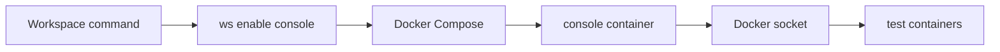
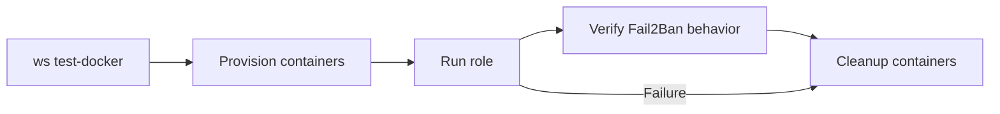

# Test Harness

This document describes the Fail2Ban role test harness. Local test operations
run through Workspace, which owns the repository Docker Compose environment.

## Table of Contents

- [Coverage](#coverage)
- [Setup](#setup)
- [Workspace Commands](#workspace-commands)
- [Workspace Compose Environment](#workspace-compose-environment)
- [Container Tests](#container-tests)
- [Jenkinsfile Lint](#jenkinsfile-lint)
- [Clean Up](#clean-up)
- [Notes](#notes)

## Coverage

The default inventory exercises systemd-enabled container images for the latest
stable release and one still-relevant previous stable or LTS release:

| Family | Latest stable image | Previous stable or LTS image |
| --- | --- | --- |
| Debian | `geerlingguy/docker-debian13-ansible:latest` | `geerlingguy/docker-debian12-ansible:latest` |
| Enterprise Linux | `geerlingguy/docker-rockylinux10-ansible:latest` | `geerlingguy/docker-rockylinux9-ansible:latest` |
| Ubuntu | `geerlingguy/docker-ubuntu2604-ansible:latest` | `geerlingguy/docker-ubuntu2404-ansible:latest` |

The container harness validates package installation, managed `jail.local`
rendering, service startup, and `fail2ban-client status`. The test playbook
adds a disabled `sshd` jail to prove jail rendering without depending on
distribution-specific SSH log availability inside the containers.

No cloud inventory is included. The role manages local packages,
configuration, and service state, so Docker is the correct validation scope for
the current behavior.

## Setup

Install the Workspace CLI before running the test commands if `ws` is not
already available.

```bash
WS_VERSION=0.4.1
curl --output ./ws --location "https://github.com/my127/workspace/releases/download/${WS_VERSION}/ws"
chmod +x ws && sudo mv ws /usr/local/bin/ws
```

Workspace release commands read local attributes from `workspace.override.yml`.
Create it from the example only when release tokens are needed:

```text
cp workspace.override.yml.example workspace.override.yml
```

Set the Workspace attributes needed for publication commands:

| Attribute | Used by | Purpose |
| --- | --- | --- |
| `ansible.galaxy.token` | Release commands | Ansible Galaxy API token used by token-required Galaxy checks, status, and import commands. |
| `github.api_token` | Release commands | GitHub API token used by GitHub release checks and publication commands. |

For example:

```ruby
attribute('ansible.galaxy.token'): 'your-galaxy-token'
attribute('github.api_token'): 'your-github-token'
```

Container tests do not require override values or secrets.

## Workspace Commands

The preferred local entrypoint is Workspace:

```text
ws
```

Useful commands:

```text
ws ansible syntax
ws ansible lint
ws ansible playbook tests/playbook.yml tests/inventory-docker
ws lint-jenkinsfile
ws test-docker
```

Use `ws console` with no argument for an interactive shell when a command needs
shell quoting. The non-interactive `ws console <command>` form is intentionally
limited to simple whitespace-separated commands used by Workspace helpers.

Use `ws ansible syntax` for syntax checks. Internally it calls
`ws ansible playbook` with the Workspace syntax-check flag.

## Workspace Compose Environment

The repository Docker Compose environment is needed because local tests run
from the same Ansible console container used by Workspace. That console
container also starts and removes the systemd-enabled target containers used by
`ws test-docker`.

The console image uses:

```text
quay.io/inviqa_images/ansible:2.20-python3.13-trixie
```

Workspace resolves the host Docker socket group ID and passes it to Compose as
`HOST_DOCKER_GID`. Compose applies that numeric ID through `group_add`, which
makes it a supplemental group for processes started in the `console` container.
The commands still run as the `ansible` user, but they can access the mounted
Docker socket.

The root group is also added because Docker Desktop exposes the mounted socket
inside the container as `root:root`. On Linux/Jenkins, the host socket group ID
is the relevant group.

The harness does not mount SSH agent sockets or host SSH configuration. This
role has no SSH execution path, so local validation only needs the repository
checkout and Docker socket.

This boundary is defined by `workspace.yml` and `docker-compose.yml`.



## Container Tests

Run the default container-backed validation:

```text
ws test-docker
```

The command runs the test playbook and then the cleanup playbook, even when the
main playbook fails.

Run syntax-only validation:

```text
ws ansible syntax
```

The validation phase creates local containers, runs the role, verifies
configuration and service behavior, and removes the containers.



## Jenkinsfile Lint

Validate the repository `Jenkinsfile` with the Workspace Jenkins lint
controller:

```text
ws lint-jenkinsfile
```

The command starts the `jenkins-lint` service and submits the local
`Jenkinsfile` to Jenkins' pipeline model validator.

## Clean Up

Remove local test containers and the Workspace environment:

```text
ws ansible playbook tests/playbook_cleanup.yml tests/inventory-docker
ws destroy
```

`ws test-docker` already runs the cleanup playbook after the main playbook. Run
the cleanup commands directly only after interrupted manual tests.

## Notes

- The tracked `tests/roles/ansible-fail2ban` symlink lets Ansible resolve the
  checked-out role by name in Jenkins job workspaces.
- `tests/requirements.yml` installs only `community.docker` because the role
  has no cloud-provider test dependency.
- The Workspace console intentionally has no SSH-agent or SSH config mount.
- `workspace.override.yml` is intentionally gitignored and should only contain
  local release credentials.
